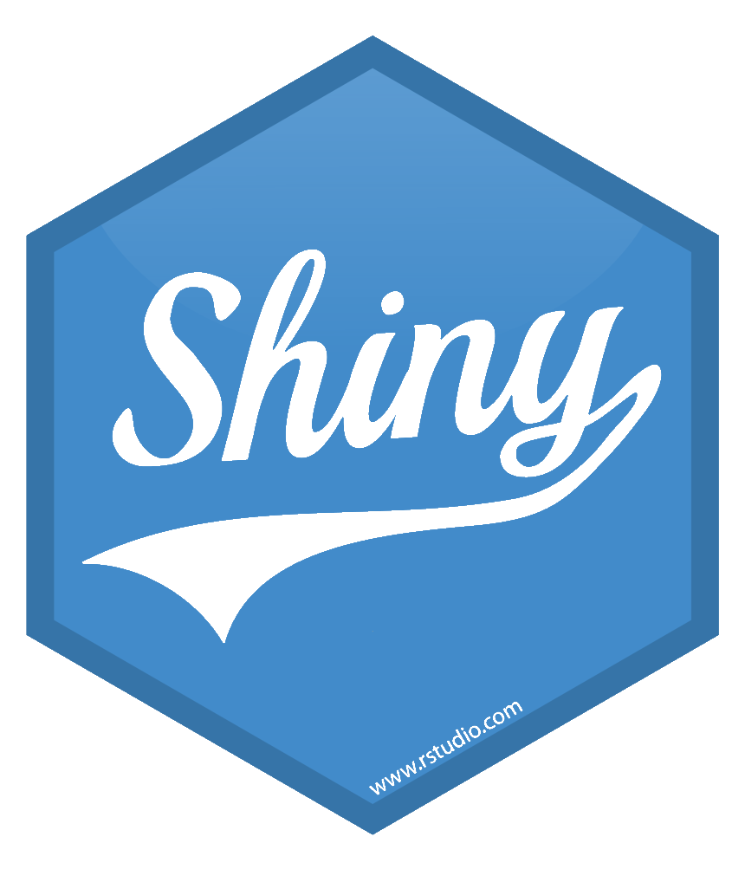
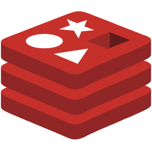

<!--  -->

    

# Frej Sundqvist
Problem solver, Programmer, Engineer

<a href="https://myosq.github.io" target="_blank">Blog</a>
| 
<a href="https://github.com/MyosQ" target="_blank">Github</a>
|
<a href="https://www.linkedin.com/in/frej-sundqvist-b8a49a14b/" target="_blank">LinkedIn</a>

## Currently

Fullstack developer and engineer at Capia AS in Tromsø, Norway.
Developing apps using Django, Reactjs and RShiny among others. Working with databases like MariaDB and Postgres, including postgis. Both directly in SQL and through ORM's. I Deploy apps using docker and nginx as reverse proxy. Experienced at writing dockerfiles, using dockercompose, and some kubernetes.

## Skills

<!-- List of label+image. Some one same line -->

    
Python

    
Django

    
R

    
RShiny

    
C

    
MariaDB

    
Postgresql

    
Postgis

    
Redis

    
Reactjs

    
Nodejs

    
TypeScript

    
JavaScript

    
HTML

    
CSS

## Work experience

`2021 - Present`
__Capia AS__
- Fullstack developer and engineer

## Education

`2015 - 2020`
__Umeå Universitet__ {:class="education-logo"}
- Master's degree in engineering physics

`2018 - 2019`
__Julius-Maximilians-Universität Würzburg__ {:class="education-logo"}
- Mathematics and robotics

`2012 - 2015`
__Naturvetenskapsprogrammet, Luleå__ {:class="education-logo"}
- Natural sciences

## Languages

Swedish <!-- {:height="22px" width="auto" style="position:absolute; margin-left:6px;"} -->

English <!-- {:height="22px" width="auto" style="position:absolute; margin-left:6px;"} -->

German <!-- {:height="22px" width="auto" style="position:absolute; margin-left:6px;"} -->

Norwegian
<!-- {:height="22px" width="auto" style="position:absolute; margin-left:6px;"} -->

## Other interests

reading, running, nature, economics

<!-- ### Footer

Last updated: May 2013 -->

