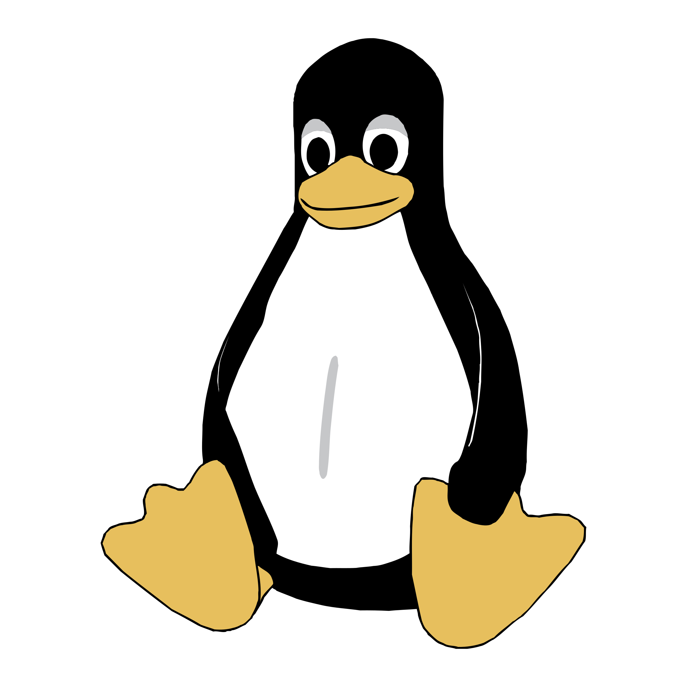

    

# Frej&nbsp;Sundqvist
Problem&nbsp;solver,&nbsp;Programmer,&nbsp;Engineer

<!-- plain link -->

<a href="https://myosq.github.io" target="_blank">Blog</a>
| 
<a href="https://github.com/MyosQ" target="_blank">Github</a>
|
<a href="https://www.linkedin.com/in/frej-sundqvist-b8a49a14b/" target="_blank">LinkedIn</a>
|
<a href="mailto:frejsundqvist@protonmail.com" target="_blank">Mail</a>
|
<a href="https://github.com/MyosQ/euler-solutions" target="_blank">Project&nbsp;Euler</a>

<!-- For Print -->

<a href="https://github.com/MyosQ" target="_blank" class="profile_links" id="github_link">MyosQ</a>
|
<a href="https://www.linkedin.com/in/frej-sundqvist-b8a49a14b/" target="_blank" class="profile_links" id="linkedin_link">frej-sundqvist-b8a49a14b</a>
 
<a href="https://myosq.github.io" target="_blank" class="profile_links" id="blog_link">myosq.github.io</a>
|
<a href="mailto:frejsundqvist@protonmail.com" target="_blank" class="profile_links" id="email_link">frejsundqvist@protonmail.com</a>

<!-- link with svg img -->
<!-- 

<a href="https://myosq.github.io" target="_blank" class="profile_links" id="blog_link">Blog</a>
| 
<a href="https://github.com/MyosQ" target="_blank" class="profile_links" id="github_link">Github</a>
|
<a href="https://www.linkedin.com/in/frej-sundqvist-b8a49a14b/" target="_blank" class="profile_links" id="linkedin_link">LinkedIn</a>
|
<a href="mailto:frejsundqvist@protonmail.com" target="_blank" class="profile_links" id="email_link">Mail</a>
|
<a href="https://github.com/MyosQ/euler-solutions" target="_blank" class="profile_links" id="euler_link">Project&nbsp;Euler</a>

 -->

## Me
A born engineer and problem solver with a genuine interest in Tech, Mathematics and Physics. I love the process of learning new concepts and technologies. My ambition is to continue to learn and to always stay curious. I am also a skilled communicator, with experience in leading teams of developers and interacting directly with customers.

## Skills

<!-- List of label+image. Some one same line -->

    

        Python
        Django
        R
        RShiny
        C
        Matlab
    

    

        Docker
        NGINX
        Apache Airflow
        Apache Kafka
    

    

        Pytorch
    

    

        MariaDB
        Postgresql
        Postgis
        Redis
    

    

        Reactjs
        Nodejs
        TypeScript
        JavaScript
        HTML
        CSS
    

    

        Git
        DevOps
        Linux
        Bash
    

## Work experience

`2021 - Present`
__Capia AS - Fullstack developer, AI engineer and project&nbsp;leader__  

- `*` Building apps from scratch to deployment.
- `*` Fine-tuning Neural Networks for image segmentation and classification.
- `*` Leading teams of developers and interacting directly with customers.
- `*` System administering of servers and databases.

## Education

`2015 - 2020`
__Umeå Universitet__ {:class="education-logo"}
- Master's degree in engineering physics

`2018 - 2019`
__Julius-Maximilians-Universität Würzburg__ {:class="education-logo"}
- Mathematics and robotics

`2012 - 2015`
__Naturvetenskapsprogrammet, Luleå__ {:class="education-logo"}
- Natural sciences

## Languages

Swedish  
English  
German  
Norwegian  

Swedish, English, German, Norwegian

## Other interests

Reading books  
Running  
Fishing  
Being in nature  
Playing music  

Reading books, running, fishing, being in nature and playing&nbsp;music.

<!-- ### Footer

Last updated: May 2013 -->

